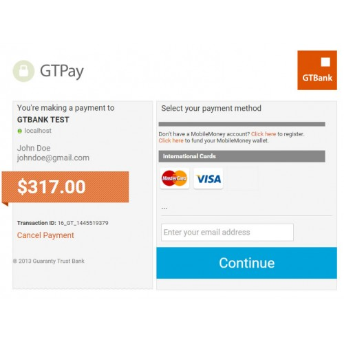

# GTPay OpenCart Extension

## Description

GTPay is a secure internet payment gateway developed to facilitate payments online using debit Cards issued by banks on the Interswitch Network. GTPay plugs in seamlessly with the existing websites of customers and acts as a bridge between the customer’s website and financial institutions (Banks). The payment solution,

    Provides a convenient alternative payment channel to all customers

    Enables cardholders to pay merchants (our customers) for internet purchases of goods and services from the comfort of their offices/homes by supplying details of their local debit/credit cards

    Ensures transaction amount is deducted from cards instantly and merchant's account credited within 24 hours

### Features

    International Acceptance: GTPAY accepts both locally and internationally issued cards including Interswitch, MasterCard and VISA.
    Timely transaction processing: Merchants get value next day after transaction takes place.
    GTPAY monitoring log: GTPAY comes with a unique, online monitoring console that allows merchants view transactions as they occur.
    Reduced sign-on fee: GTBank is a certified developer partner so we take on GTPAY integration for our merchants and as such the integration fee is waived for them.

### Install

1. Download the GtPay plugin zip file

2. Extract the downloaded file and Copy the extracted folders(admin and catalog) to "upload folder" in your OpenCart folder
3. Login to your OpenCart Admin(On your browser). Click on "Extensions > Payments" from the left hand menu
4. Scroll to "GTPay" and click install(the "+" sign changes to "-")

### Setup

1. Login to your OpenCart Admin(On your browser). Click on "Extensions > Payments" from the left hand menu

2. Scroll to "GTPay" and click Edit(button beside installation button)
3. Enter your API Credentials
4. Save the settings
5. A success message is displayed on the screen to show your plugin has been installed and the setup was successful.
